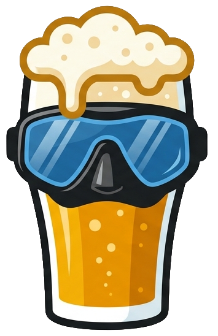

  

# TauchsportLog 🤿

TauchsportLog is a modern, responsive web application for managing consumption tracking, internal news, and billing. Built entirely with Python and Streamlit, it functions as a digital tab system with gamification elements.

### Core Features
- **Live Feed**: A real-time timeline displaying recent activity, unlocked achievements, and system updates.
- **Booking & Analytics**: Fast, mobile-optimized booking interface with detailed statistics and user leaderboards.
- **Gamification**: An automated badge system (e.g. "Early Bird", "Night Owl") that rewards users based on their activity patterns.
- **Admin Dashboard**: Comprehensive tools for managing users, editing logs, and exporting data, powered securely by a Google Sheets backend.
